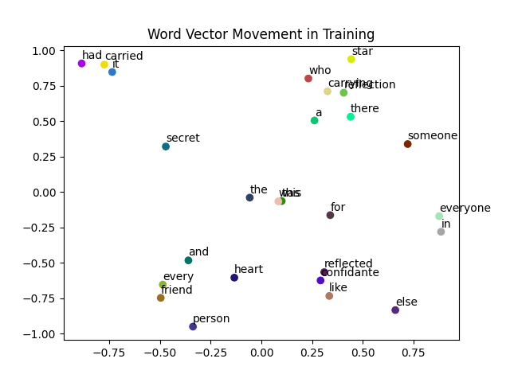
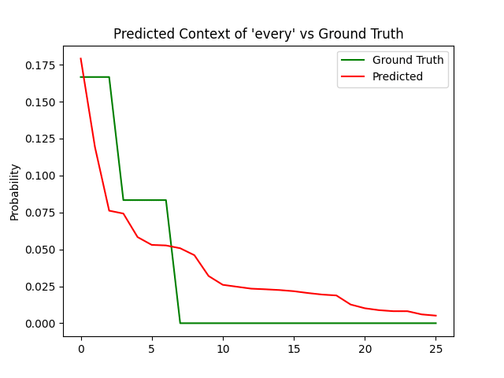

## **Skip Gram Implementation**
***
Undertaking this project as one of my initial explorations into machine learning was an invaluable experience, greatly enriching my understanding of neural network development. Through this endeavor, I have immersed myself in the intricacies of creating neural networks, allowing me to grasp the underlying concepts with greater depth. Overall, this project played huge role in expanding my knowledge and developing a deeper appreciation for the nuances involved in neural network development.
***
### **How to run:**
To run the model
<code>scripts/skip_gram_test.py</code>
on the toy corpus 
<code>data/word_dataset.txt</code>:

```
python skip_gram_test.py
```

This will create **.gif** files in the <code>visualizations</code> folder.

***
### **Results**
I decided to verify the results by tracking the vectors through training, along with the probability convergence. The training process of this program relies on a straightforward Python and NumPy implementation, which inherently restricts its scalability. However, operating at smaller scales fulfills the intended purpose and facilitates a more interactive and engaging experience.
#### <code>visualizations/vector_movement.gif</code>
- This allows us to visualize the convergence of word vectors based on the word distributions in the toy corpus.
- At scale, various semantic relationships emerge.
<br>

#### <code>visualizations/probability_convergence.gif</code><br>
- This visualization shows the model converging to the ground truth distribution of the words in the context of **'every'** in the dataset.
- The probabilities are sorted for comparison.
<br>
