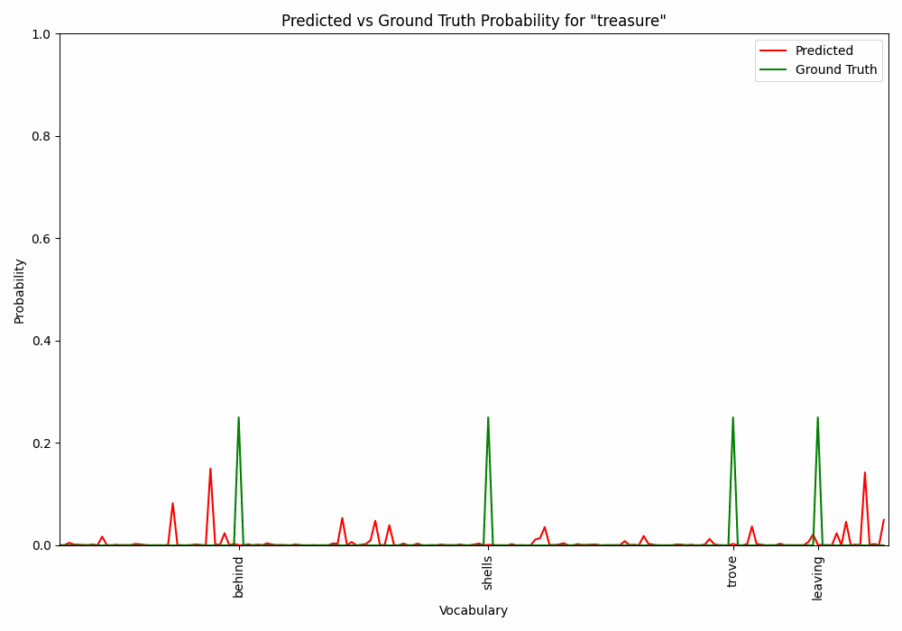

## **Skip Gram Implementation**

Undertaking this project as one of my initial explorations into machine learning was an invaluable experience, greatly enriching my understanding of neural network development. Through this endeavor, I have immersed myself in the intricacies of creating neural networks, allowing me to grasp the underlying concepts with greater depth. Overall, this project played a huge role in expanding my knowledge and developing a deeper appreciation for the nuances involved in neural network development.
<br><br>
Since my initial implementation, I recently fully refactored my code and created an in-depth project notebook on the subject! Check out the instructions below to run it!

***

### **How to Run**

To run the notebook you will need to install specific requirements:

1. Create a python virtual environment
```bash
python3 -m venv <environment-name>
```
2. Install the requirements 
```bash
pip install -r requirements.txt
```
3. Run the notebook `src/notebooks/skip_gram.ipynb`

***

If you are interested, there is also a unit_test file along with relevant utils you can adapt to test out different parts of the code.

***

### **Results**

The first set of results is the [Tensorflow Projector](https://projector.tensorflow.org/?config=https://gist.githubusercontent.com/chris-caballero/2e058818e161d7362ae51368afa00eb4/raw/76d86fc5e085ca7a2d34b8e30cf4d73047405369/projector-config.json) of our final embeddings. Use this to get a lot of interesting information on the embeddings along with different dimensionality reduction techniques!

In order to verify the results, I tracked the vectors during the training process and observed the convergence of probabilities. The implementation relies on a straightforward Python and NumPy approach, which inherently limits its scalability. However, it performs effectively at smaller scales, fulfilling its intended purpose and providing an interactive and engaging experience.

#### Vector Movement Animation

The animation below visualizes the convergence of word vectors based on the word distributions in the toy corpus. As the training progresses, various semantic relationships start to emerge - this is much clearer in large scale implementations of the Skip-Gram model that have a lot of text to work with.


#### Probability Convergence Animation

The animation below demonstrates the model converging to the ground truth distribution of words in the context of **'treasure'** within the dataset. The probabilities are sorted for comparison.



